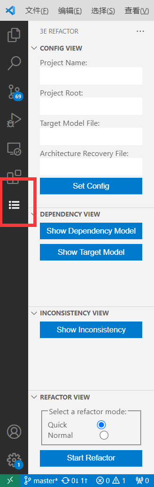
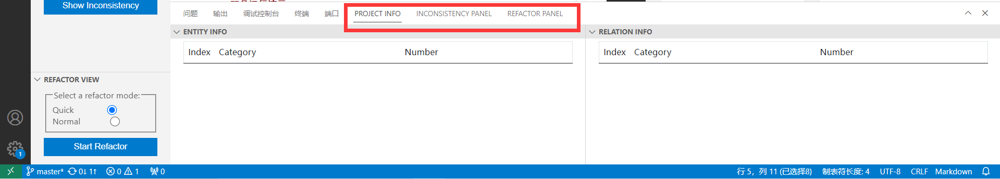

## 前端安装
前端安装包为3E-Refactor.vsix文件，从VSCode的扩展面板中选择“从VSIX安装”，导入对应文件即可。

安装成功后，VSCode页面侧边栏会多出一个图标，点击可查看到如下页面。

下方的面板也会增加Project Info、Inconsistency Panel、Refactor Panel界面。

注意：前端的运行需要8081端口。在使用插件功能前，请先点击查看这些界面，确认它们被激活。

## 后端安装
后端安装包为jar包形式，运行后端时请将所有jar包放在同一文件夹下。

输入以下命令启动后端SpringBoot服务器运行，
```bash
java -jar 3Erefactor-service.jar
```
后端服务需要占用8888端口。

出现如图所示即是启动成功。


## 工具运行演示
插件工具演示时运行环境为windows，jdk版本为17，使用的java项目为0.9.6e分支版本的depends项目
https://github.com/multilang-depends/depends

详细的工具使用流程在readme.md中可见，也可查看refactor-demo演示视频。
