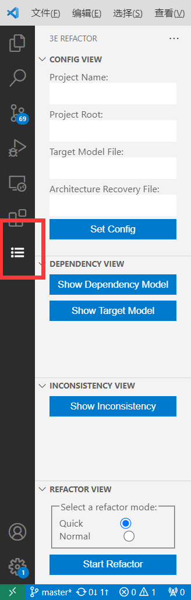
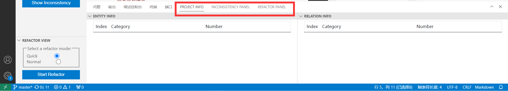
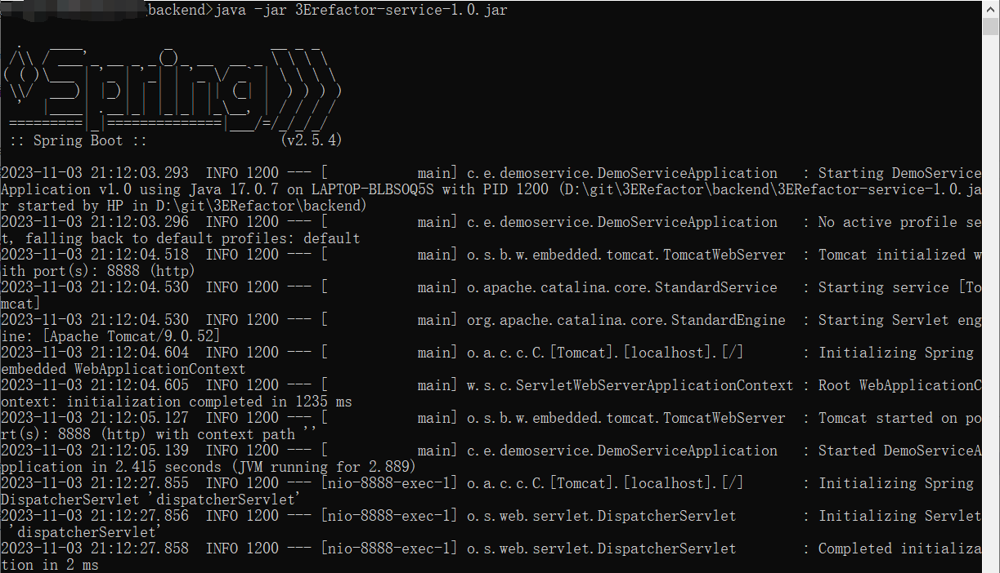

## Frontend Install
The front-end installation package is 3E-Refactor.vsix file, select "Install from VSIX" from VSCode's extension panel and import the corresponding file.

After successful installation, there will be an list icon in the sidebar of the VSCode page, click it to view the following page.

The lower panel will also add several interfaces: Project Info, Inconsistency Panel, and Refactor Panel.

**Note:** Port 8081 is required for the front-end. And before using the tool's features, please make sure these panels are activated by clicking and view them.

## Backend Install
The backend installation package is in the form of jar package, please put all the jar packages in the same folder when running the backend.

Start the command line CMD under the path where the jar package is placed and enter the following command to invoke the corresponding version of the 3ERefactor-service.jar package to start the back-end SpringBoot server running.
```bash
java -jar 3ERefactor-service.jar
```
NOTE: The backend server needs to occupy port 8888. Just start the 3ERefactor-service.jar package and put the other jar packages in the same folder. In the tool running process 3ERefactor-service.jar package will call the other jar package.

If the screen shown in the figure appears in the command line, the server starts successfully.


## Demo of the tool in action
This tool demo running environment for windows, jdk version 17, using the java project for the 0.9.6e branch version of the ["depends"](https://github.com/multilang-depends/depends) project.

A detailed flow of how to use the tool is visible in [usage-guide.md](./usage-guide-EN.md), or check out the [demo video](../demo/3Erefactor-demo-video-EN.mp4) in the demo folder.
