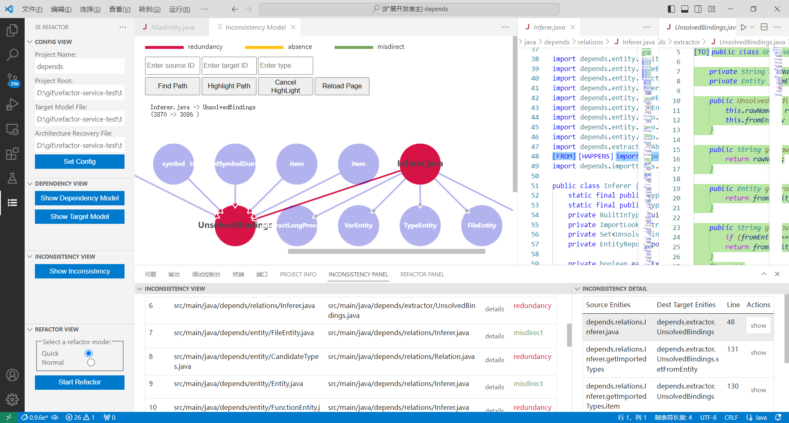
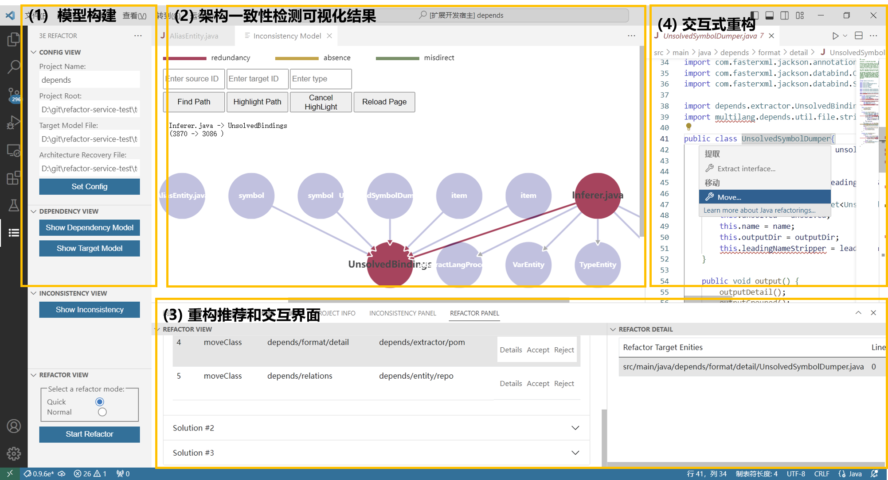

## 3Erefactor: Effective, Efficient and Executable Refactoring Recommendation for Software Architectural Consistency

As software continues to evolve and business functions become increasingly complex, architectural inconsistency arises when the implementation architecture deviates from the expected architecture design. This architectural problem makes maintenance difficult and requires significant effort to refactor. To combat this problem, we have introduced the tool 3Erefactor, which is an intelligent refactoring recommendation tool specialized in removing architectural inconsistencies.

### Online Link to Tool Demo：

   Demo in Chinese Version：https://www.bilibili.com/video/BV1UN4y1k7pE/?spm_id_from=333.999.0.0

   Demo in English Version: https://youtu.be/8QMpd9TnsE0

### **Tool Core Functions:**

   - Code Dependency Modeling and Visualization
   - Architecture Inconsistency Detection and Visualization
   - Automated Recommendations for Refactoring to Eliminate Architectural Inconsistencies
   - Interactive Code Refactoring

### **Usage Description**:

1. #### Model Construction：source model, target model, and reflexion model

   a. Enter the parameters on the left side of the plug-in interface, including Project Name, Project Root and Target Model, and then click the "Set Config" button.

   b. Click the "Show Dependency Model" button on the left side to trigger the back-end code dependency model construction process and visualize the constructed dependency model. As shown in the figure below, the square box represents the package structure, the circle represents the entities, and the lines between the circles represent the dependencies between the entities.

      

      When building the dependency model, two types of json files are generated in the root directory of the local project ("root/.enre/"), named "projectName.enre.json" and "projectName.enre.dep.json". The reflexion model is also generated and saved in json format as "projectName.rfx.json", also in the "root/.enre/" directory. Sample files can be found in the "demo/json-sample/" folder of this repository, including the [depends.enre.json](../demo/json-sample/depends.enre.json), [depends.enre.dep.json](../demo/json-sample/depends.enre.dep.json) and [depends.rfx.json](../demo/json-sample/depends.rfx.json)。

   c. Click the "Show Target Model" button on the left side, you can trigger the back-end of the target model parsing process, and visualize the target model, the visualization effect is the same as above.

   ​	This step will move the target model json file entered in the first step to the "root/.enre/" directory and rename it to "projectName.con.json". Sample files can be found in this repository at [depends.enre.con.json](../demo/json-sample/depends.enre.con.json)。

2. #### Architectural Inconsistency Detection: Automatically detect architectural inconsistencies between the code implementation and the target architectural design.

   a. Click the button "Show Inconsistency" on the left side of the plug-in interface, it will start to execute the architecture consistency detection, the inconsistency information will be displayed in the "INCONSISTENCY PANEL" at the bottom of the interface, including "misdirect", "absence" and "redundancy", three inconsistency categories. Then by clicking the "Show" button on the right side, the results of the architecture inconsistency visualization will be displayed in the "Inconsistency Model" area in the middle of the interface, as shown in the figure below.

   

   The generated inconsistent dependency information will be saved as json in the "root/.enre/projectName.enre.inconsist.json" file. Sample files can be found in [depends.enre.inconsist.json](../demo/json-sample/depends.enre.inconsist.json)。

3. #### Automatic Refactoring Recommendation: Automatically search for sequences of refactoring operations to eliminate architectural inconsistencies

   a. Click "Start Refactor" button on the left side of the plug-in interface, it will start searching and automatically recommend a series of refactoring operations that can eliminate architectural inconsistencies (including but not limited to 10 types of refactoring operations such as "move class" and "move method"), and display a list of these refactoring operation recommendations in the "REFACTOR PANEL" at the bottom of the interface, as shown in Figure (3) below.

   

   The searched refactorings will be saved as json files as "root/.enre/projectName.refactor.out.json". Sample files can be found in this repository at [depends.refactor.out.json](../demo/json-sample/depends.refactor.out.json)。

4. #### Interactive Code Refactoring:  User interacts with the refactoring operations

   a. In the interactive code refactoring stage, users can choose to "Accept" or "Reject" each refactoring operation from the list of refactoring suggestions provided in the previous step. When the user selects "Accept", the corresponding refactoring operation will be grayed out, and the right side of the interface will automatically jump to the target refactoring code location of the project and trigger the corresponding refactoring operation pop-up window (as shown in Figure (3) above). In addition, the architectural inconsistencies that can be eliminated by this refactoring operation will be highlighted in gray in the inconsistency display interface "INCONSISTENCY PANEL". When the user selects "Reject", the refactoring action entry will be grayed out, and the system will no longer recommend this action to the user!
