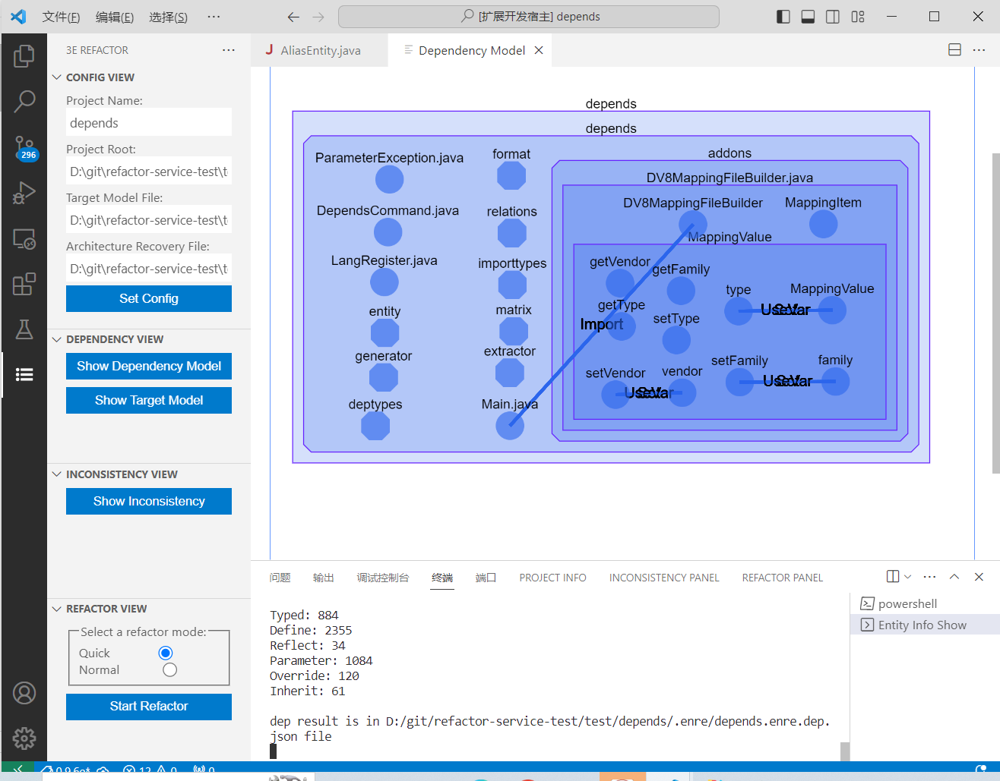
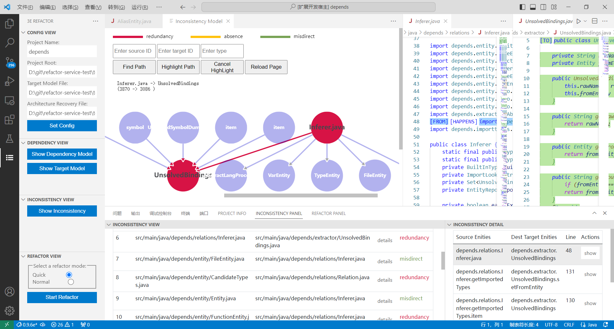
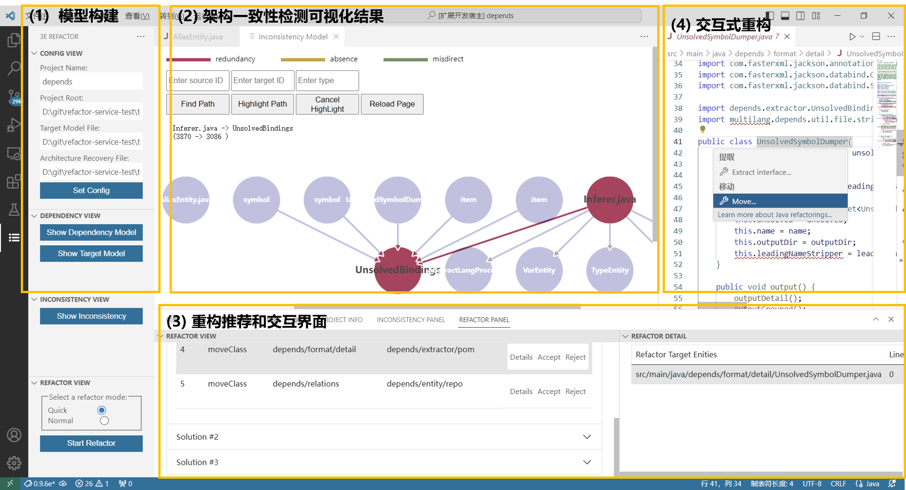

## 3Erefactor: 面向架构一致性的智能重构方法与工具

为了应对随着软件的不断发展，业务功能变得越来越复杂，软件的实现不可避免的和预期的架构设计出现偏离，从而导致架构不一致的出现。架构不一致使软件维护变得困难，并且需要付出大量的努力来进行重构。为了应对这个问题，我们推出了工具3Erefactor，它是一个专门针对消除架构不一致的智能重构推荐工具。

### **工具视频链接：**

​	中文版：https://www.bilibili.com/video/BV1UN4y1k7pE/?spm_id_from=333.999.0.0

​	英文版：https://youtu.be/8QMpd9TnsE0

### **核心功能**:

   - 代码依赖模型构建和可视化
   - 架构不一致检测和可视化
   - 消除架构不一致的自动重构推荐
   - 交互式代码重构

### **使用说明**:

   1. #### 模型构建：构建源模型、目标模型和反射模型

      a. 在该插件界面左侧输入参数：包括项目名称（Project Name）、项目根目录（Project Root）、目标模型（Target Model），然后点击“Set Config”按钮。

      b. 点击左侧的“Show Dependency Model”按钮，可以触发后端的代码依赖模型构建过程，并对构建的依赖模型进行可视化展示。如下图所示，方框代表包结构，圆圈代表实体，圆圈之间的连线代表实体之间存在的依赖关系。

         

         在构建依赖模型时，将在本地项目的根目录 root/.enre/ 中生成两种 json 文件，分别命名为 projectName.enre.json 和 projectName.enre.dep.json。同时，也会生成反射模型，并将其以 json 格式保存为 projectName.rfx.json 文件，同样存放在 root/.enre/ 目录下。在本仓库的 demo/json-sample/ 目录中可以找到示例文件，包括 [depends.enre.json](../demo/json-sample/depends.enre.json)、[depends.enre.dep.json](../demo/json-sample/depends.enre.dep.json) 和 [depends.rfx.json](../demo/json-sample/depends.rfx.json)。

      c. 点击左侧的“Show Target Model”按钮，可以触发后端对目标模型解析过程，并对目标模型进行可视化展示，可视化效果同上。

         该步骤会将第一步输入的目标模型json文件移动到root/.enre/目录下，并重命名为projectName.con.json。示例文件可参见本仓库的[depends.enre.con.json](../demo/json-sample/depends.enre.con.json)。

   2. #### 架构一致性检测：自动检测代码实现和目标架构设计之间的架构不一致。

      a. 在插件界面左侧点击按钮“Show Inconsistency”，便开始执行架构一致性检测，不一致信息将在界面下方的“INCONSISTENCY PANEL”中展示，包含“misdirect”不一致类别、“absence”不一致类别和“redundancy”不一致类别。然后通过点击右侧的“Show”按钮，架构不一致的可视化结果将于界面中间的“Inconsistency Model”区域展示，如下图所示。

      

      生成的不一致依赖信息将以json形式保存在root/.enre/projectName.enre.inconsist.json文件。示例文件可参见[depends.enre.inconsist.json](../demo/json-sample/depends.enre.inconsist.json)。

   3. #### 自动重构推荐：自动搜索消除架构不一致的重构操作序列

      a. 在插件界面左侧下方点击按钮“Start Refactor”，会开始搜索并自动推荐能消除架构不一致的一系列重构操作（包括但不限于“移动类（move class）”和“移动方法（move method）”等10种重构操作类型），并在界面下方的“REFACTOR PANEL”中展示这些重构操作的建议列表，如下图(3)所示。

      

      搜索到的重构方案将以json文件形式保存为root/.enre/projectName.refactor.out.json。示例文件可参见本仓库的[depends.refactor.out.json](../demo/json-sample/depends.refactor.out.json)。

   4. #### 交互式代码重构：用户与重构操作之间的交互

      在交互式代码重构阶段，用户可以针对上一步展示的重构建议列表中的每个重构操作做出“Accept”或“Reject”选择。当用户选择“Accept”时，相应的重构操作条目将变为灰色，同时界面的右侧会自动跳转到项目的目标重构代码位置，并触发相应的重构操作弹窗（如上图(3)所示）。此外，该重构操作所能消除的架构不一致将在不一致展示界面“INCONSISTENCY PANEL”被灰色高亮显示。当用户选择“Reject”时，该重构操作条目将变为灰色，且系统将不再推荐此操作给用户。
